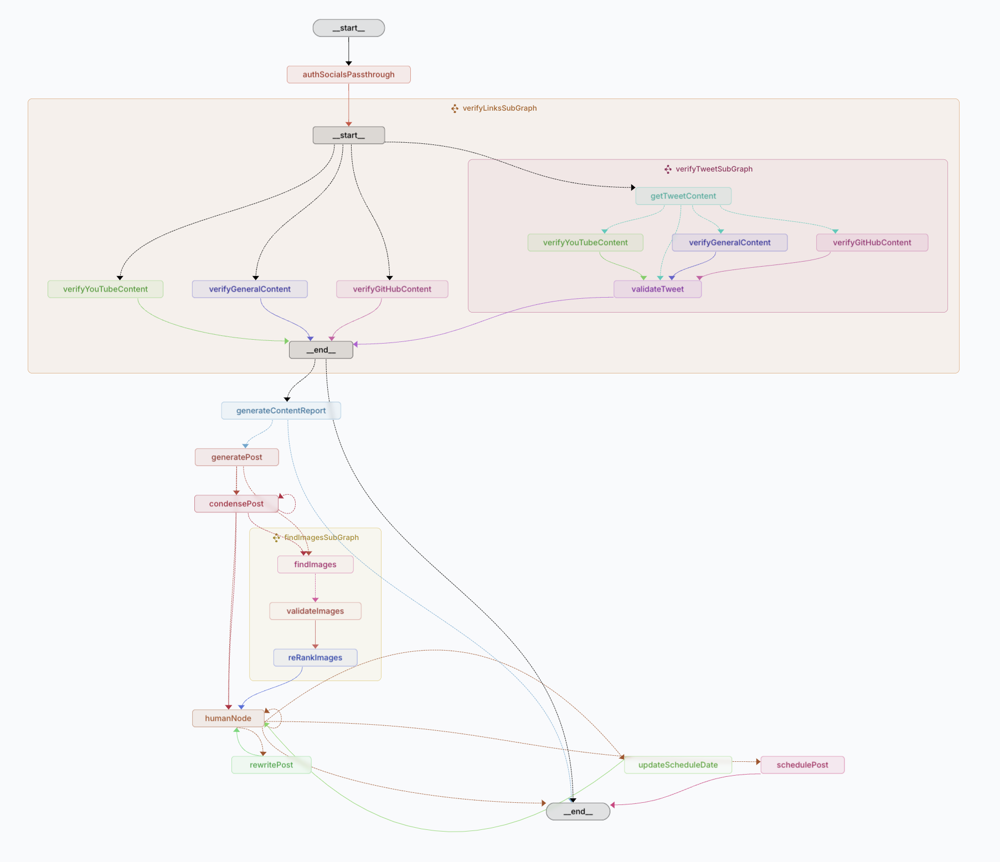

# Social Media Agent

This repository contains an 'agent' which can take in a URL, and generate a Twitter & LinkedIn post based on the content of the URL. It uses a human-in-the-loop (HITL) flow to handle authentication with different social media platforms, and to allow the user to make changes, or accept/reject the generated post.



## Setup

### Prerequisites

To use this project, you'll need to have the following accounts/API keys:

- [Yarn](https://yarnpkg.com/)
- [Node.js](https://nodejs.org/en)
- [Docker](https://www.docker.com/)
- [LangGraph CLI](https://langchain-ai.github.io/langgraph/cloud/reference/cli/)
- [Anthropic API](https://console.anthropic.com/)
- [Google Vertex AI](https://cloud.google.com/vertex-ai) TODO: Can we use GenAI instead??
- [FireCrawl API](https://www.firecrawl.dev/)
- [Arcade](https://www.arcade-ai.com/)
- [Twitter Developer Account](https://developer.twitter.com/en/portal/dashboard)
- [LinkedIn Developer Account](https://developer.linkedin.com/)
- [GitHub API](https://github.com/settings/personal-access-tokens)
- [Supabase](https://supabase.com/)
- [Slack Developer Account](https://api.slack.com/apps) (optional)

### Setup Instructions

#### Clone the repository:

```bash
git clone https://github.com/langchain-ai/social-media-agent.git
```

```bash
cd social-media-agent
```

#### Install dependencies:

```bash
yarn install
```

#### Set environment variables.

Copy the values of `.env.example` to `.env`, then update the values as needed.

```bash
cp .env.example .env
```

#### Setup Arcade authentication with LinkedIn and Twitter:

- [LinkedIn Arcade auth docs](https://docs.arcade-ai.com/integrations/auth/linkedin)
- [Twitter Arcade auth docs](https://docs.arcade-ai.com/integrations/auth/x)

Once done, ensure you've added the following environment variables to your `.env` file:

- `ARCADE_API_KEY`
- `TWITTER_API_KEY`
- `TWITTER_API_KEY_SECRET`
- `LINKEDIN_CLIENT_ID`
- `LINKEDIN_CLIENT_SECRET`

Arcade does not yet support Twitter (X) API v1, which is required for uploading media to Twitter. To configure the Twitter API v1, you'll need to follow a few extra steps:

1. Create an app in the Twitter Developer Portal, or use the default app.
2. Enter app settings, and find the `User authentication settings` section. Start this setup.
3. Set `App permissions` to `Read and write`. Set `Type of app` to `Web app`. Set the `Callback URI / Redirect URL` to `http://localhost:3000/callback`. Save.
4. Navigate to the `Keys and tokens` tab in the app settings, and copy the `API key` and `API key secret`. Set these values as `TWITTER_API_KEY` and `TWITTER_API_KEY_SECRET` in your `.env` file.
5. Run the `yarn start:auth` command to run the Twitter OAuth server. Open [http://localhost:3000](http://localhost:3000) in your browser, and click `Login with Twitter`.
6. After logging in, copy the user token, and user token secret that was logged to the terminal. Set these values as `TWITTER_USER_TOKEN` and `TWITTER_USER_TOKEN_SECRET` in your `.env` file.

#### Setup Supabase

Supabase is required for storing images found/generated by the agent. To setup Supabase, create an account and a new project.

Set the `SUPABASE_URL` and `SUPABASE_SERVICE_ROLE_KEY` environment variables to the values provided by Supabase.

Create a new storage bucket called `images`. Make sure the bucket is set to public to the image URLs are accessible. Also ensure the max upload size is set to at least 5MB inside the global project settings, and the bucket specific settings.

#### Setup Slack

Slack integration is optional, but recommended if you intend on using the `ingest_data` agent. This agent can be used in a cron job to fetch messages from a Slack channel, and call the `generate_post` graph for each message. We use this flow internally to have a single place for submitting relevant URLs to the agent, which are then turned into posts once daily.

To configure the Slack integration, you'll need to create a new Slack app and install it into your desired Slack workspace. Once installed, ensure it has access to the channel you want to ingest messages from. Finally, make sure the `SLACK_BOT_TOKEN` environment variable is set.

#### Setup GitHub

The GitHub API token is required to fetch details about GitHub repository URLs submitted to the agent. To get a GitHub API token, simply create a new fine grained token with the `Public Repositories (read-only)` scope at a minium. If you intend on using this agent for private GitHub repositories, you'll need to give the token access to those repositories as well.

#### Setup LangGraph CLI

The LangGraph CLI is required for running the LangGraph server locally (optionally you may use the LangGraph Studio application if you're running on Mac. See [these docs](https://github.com/langchain-ai/langgraph-studio) for a setup guide).

[Follow these instructions to download the LangGraph CLI](https://langchain-ai.github.io/langgraph/cloud/reference/cli/).

Once the CLI is installed, you can run the following command to start the local LangGraph server:

```bash
yarn langgraph:up
```

This executes the following command:

```bash
langgraph up --watch --port 54367
```

> [!NOTE]
> You must either have your `LANGSMITH_API_KEY` set as an environment variable (e.g., via `export LANGSMITH_API_KEY="..."` in your shell config like `.zshrc` or `.bashrc`), or include it inline when running the command

## Basic Usage

Once all the required environment variables are set, you can try out the agent by running the `yarn generate_post` command.

Before running, ensure you have the following environment variables set:

- `TWITTER_USER_ID` & `LINKEDIN_USER_ID` - The email address/username of the Twitter & LinkedIn account you'd like to have the agent use. (only one of these must be set).
- `LANGGRAPH_API_URL` - The URL of the local LangGraph server. **not** required if you passed `--port 54367` when running `langgraph up`.

This will run the [`generate-demo-post.ts`](scripts/generate-demo-post.ts) script, which generates a demo post on the [Open Canvas](https://github.com/langchain-ai/open-canvas) project.

After invoking, visit the [Agent Inbox](https://agent-inbox-nu.vercel.app) and add the local inbox in settings, passing in the following fields:

- Your LangSmith API key

Then click `Add Inbox` and add the following fields:

- Graph ID: `generate_post`
- Graph API URL: `http://localhost:54367` (or whatever port you set for your LangGraph server)
- Name: (optional) `Generate Post (local)`

Once submitted you should see a single interrupt event! Follow the instructions in the description to authorize your Twitter/LinkedIn account(s), then accept to continue the graph and have a post draft generated!
